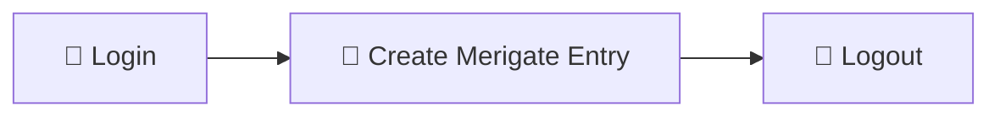

# 🚀 Merigate Entry

> A powerful Frappe application to receive and manage **Merigate invoice entries** via REST API.

---

## 📌 Overview

External systems can push invoice data directly into Frappe using secure REST APIs.

The application automatically creates **Merigate Entry** documents — eliminating manual data entry.

---

# 🔄 API Flow



### Workflow

1. 🔐 Login → Get SID Token
2. 📄 Send Invoice Data + PDF → Create Entry
3. 🚪 Logout → Invalidate Session

> ⚠️ All protected APIs require a valid `SID` token from the Login API.

---

# ⚙️ Installation

```bash
cd $PATH_TO_YOUR_BENCH

bench get-app $URL_OF_THIS_REPO --branch main

bench install-app merigate_entry

bench --site your-site.com migrate

sudo supervisorctl restart all
```

---

# 🌐 API Endpoints

---

# 🔐 Step 1 — Login

## Endpoint

```http
POST /api/method/merigate_entry.merigate_entry.api.merigate_api.login_user
```

---

## Headers

| Key          | Value            |
| ------------ | ---------------- |
| Content-Type | application/json |

---

## Request Body

```json
{
  "usr": "merigateapi@meril.com",
  "pwd": "Merigate@123"
}
```

---

## ✅ Success Response

```json
{
  "status": "success",
  "message": "Login successful",
  "sid": "f56a09ffd087655a369328966889c54a880ff17bac051fada1e23d",
  "full_name": "Ashutosh Tripathi"
}
```

> 📌 Copy the `sid` value — it is required for all further API calls.

---

# 📄 Step 2 — Create Merigate Entry

## Endpoint

```http
POST /api/method/merigate_entry.merigate_entry.api.merigate_api.create_merigate_entry
```

---

## Headers

| Key          | Value               | Description                 |
| ------------ | ------------------- | --------------------------- |
| Cookie       | sid=<token>         | SID received from Login API |
| Content-Type | multipart/form-data | Required for file upload    |

---

## Request Body (`form-data`)

| Field            | Type       | Required | Description                 |
| ---------------- | ---------- | -------- | --------------------------- |
| gate_entry_no    | Text       | ✅ Yes   | Becomes document ID         |
| company          | Text       | ✅ Yes   | Company name                |
| category         | Text       | ❌ No    | Default: General Purchase   |
| name_of_supplier | Text       | ✅ Yes   | Vendor name                 |
| invoice_value    | Number     | ✅ Yes   | Final invoice amount        |
| gate_entry_date  | Date       | ✅ Yes   | Format: YYYY-MM-DD          |
| inward_location  | Text       | ❌ No    | Entry location              |
| status           | Text       | ❌ No    | Default: Open               |
| file             | File (PDF) | ❌ No    | Invoice/supporting document |

---

## 🧾 Sample Values

```txt
gate_entry_no   : GE-001
company         : Micro Life Science Pvt Ltd
category        : General Purchase
name_of_supplier: Pranav Wani
invoice_value   : 125000
gate_entry_date : 2026-05-15
inward_location : Meril Main Gate
status          : Open
file            : Invoice.pdf
```

---

## ✅ Success Response

```json
{
  "status": "success",
  "docname": "GE-001",
  "file_url": "/private/files/Invoice.pdf"
}
```

---

# 🚪 Step 3 — Logout

## Endpoint

```http
POST /api/method/merigate_entry.merigate_entry.api.merigate_api.logout_user
```

---

## Headers

| Key    | Value       |
| ------ | ----------- |
| Cookie | sid=<token> |

---

## ✅ Success Response

```json
{
  "status": "success",
  "message": "Logged out successfully.",
  "user": "merigateapi@meril.com"
}
```

---

# ✨ Key Features

✅ `gate_entry_no` automatically becomes the document ID  
✅ Duplicate gate entries saved with suffix `-1`, `-2`  
✅ PDF file attachment supported  
✅ Role-based access using **Merigate Entry User** role  
✅ Session timeout configurable via System Settings  
✅ Clean API error handling for:

- expired sessions
- invalid credentials
- duplicate entries

---

# 🔒 Access Control

Assign the following role to API users inside Frappe:

```txt
Merigate Entry User
```

Path:

```txt
User → Roles → Merigate Entry User
```

---

# 🧪 Testing via Postman

### Step 1

Call **Login API** → Copy `sid`

### Step 2

Call **Create Entry API**

Add Header:

```txt
Cookie: sid=<token>
```

Use:

```txt
Body → form-data
```

Set:

```txt
file → Type = File
```

---

# 🛠️ Development

```bash
cd apps/merigate_entry

pre-commit install
```

---

## 🔍 Pre-commit Tools

- Ruff
- ESLint
- Prettier
- PyUpgrade

---

# 📜 License

MIT License

---

# ❤️ Built with Frappe Framework

Powered by:

- ⚡ Frappe
- 🧾 ERPNext Ecosystem
- 🔐 REST APIs
- 📦 Python
